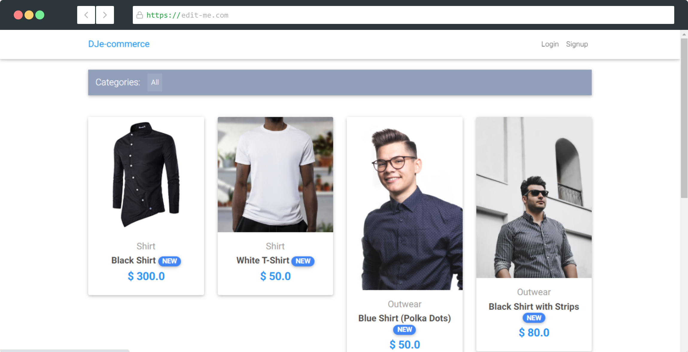
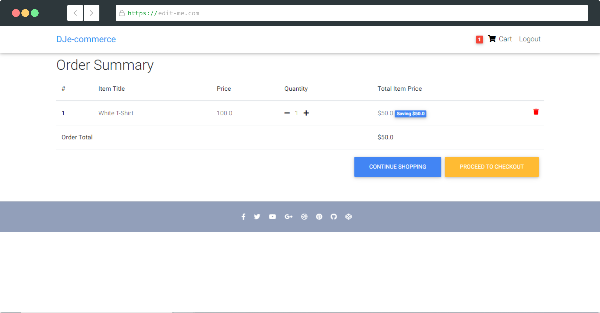
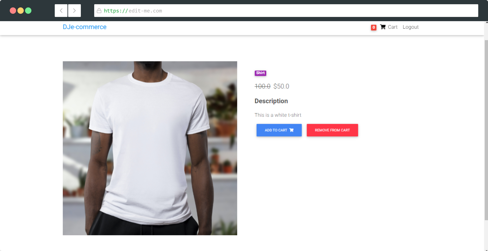
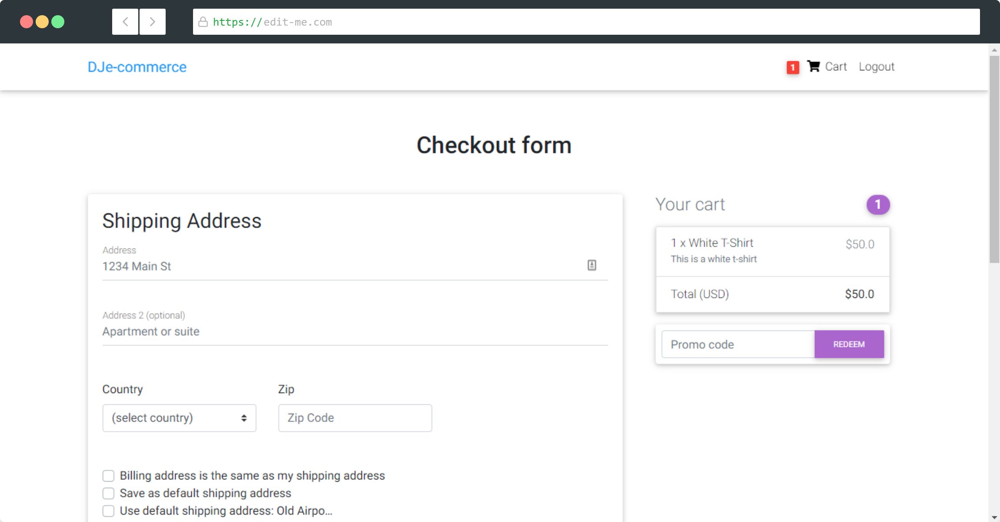
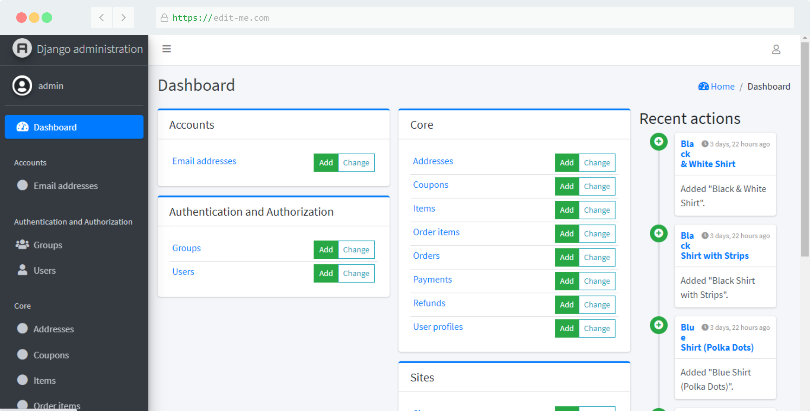
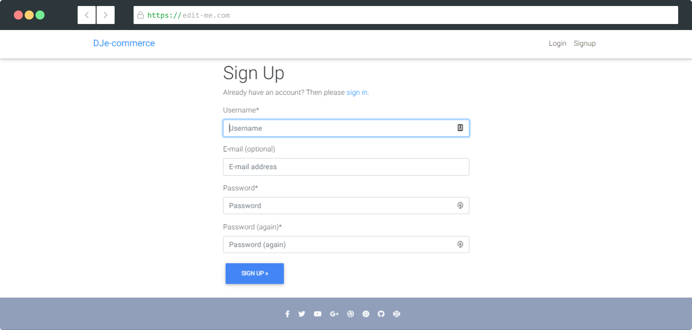

# Django Ecommerce Website

This repository is an ecommerce website using Django as the backend. 

## Screenshots

## Getting started (Windows)

Steps:

1. Clone/pull/download this repository
2. Create a virtualenv with `virtualenv env` and install dependencies with `pip install -r requirements.txt`
3. Start the virtualenv by using the command `source env/Scripts/activate/`  
4. Run the django server by `python manage.py runserver`
5. Open your browser, and go to `localhost:8000` for the website 

## About Repo

This repository is an e-commerce website using __Django__. A user can log into the website and sign up; this feature was done by the help of __Django All-Auth__. The user can then see different products available in the store and can select the item that he wants and proceed to checkout. 
The checkout process is relatively simple, and once he/she finalizes the product that they want, they can further complete the checkout process by entering in their shipping and billing addresses. You also have the option of saving your shipping and billing addresses for future use. 
Once your addresses are filled in, you have two modes of payment. One is by using the __Stripe API__ to handle the card transactions, and the other is by using __PayPal__. 

If you would like to see a demo of the checkout process, you can use the Stripe's Dummy card details. 

The card number: `4242 4242 4242 4242`.
The CVV and ZIP can be any random digits. The expiry date must be a future date.

And once the billing is done, the entire shopping process is complete. 
